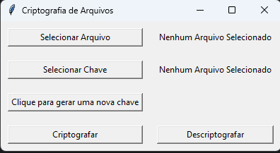

# Docs Encryption

### Packages used:

+ cryptography.fernet
+ tkinter
+ tkinter.filedialog
+ datetime
+ os

## Description

This project's objective is to enable encryption available to anyone who wants to add
security to their personal documents.

"criptografar.py" and "descriptografar.py" are respectively responsible for the encryption
and decryption of any kind of files/documents.

"gerador_chave.py" is necessary to create a key, everytime this code is executed a new key
with a different name is generated, note that every encrypted file will receive a new name
with a number code attached to it, this code is directly related to the key used for the encryption,
so it's easier to understand which key was used on each encrypted file. Without a key it's
impossible to encrypt/decrypt files as such the generated key must never be deleted or lost.

## Rules

+ Never change the file's name after encryption;
+ Don't encrypt files with "__" on it's name;
+ Don't lose the key or change the key's name.

## Interface

"interface.py" is the python scrypt that contains the user interface and is responsible for
connecting "gerador_chave.py", "criptografar.py" and "descriptografar.py" together. The interface
is simple but very effective, it displays both "success" and "error" messages.

